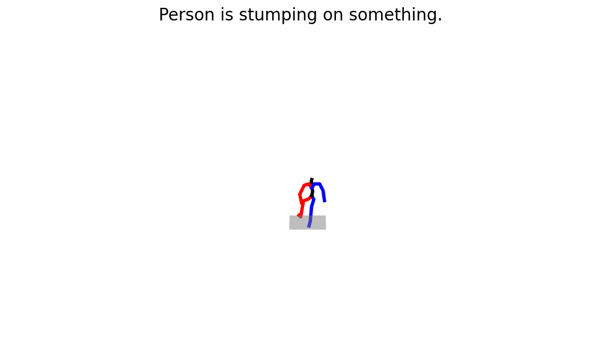

# Human Motion - Motion2Text & Text2Motion

<center></center>
<!--  -->

## Overview

This project explores the intersection of **Natural Language Processing** and **human motion synthesis**. The project aims to build models that work **bidirectionally**:  

1. **Gesture-to-Motion Generation** – generate 3D human motion from textual descriptions of gestures.  
2. **Motion-to-Text Generation** – generate natural language descriptions from sequences of 3D human motion.  

> **Current focus:** This version of the project implements **Motion-to-Text Generation**. Gesture-to-Motion generation is planned for future work.  

This project is based on a courses conducted by `Hazem Wannous` professor at IMT Nord Europe.
The project uses the HumanML3D dataset containing 3D human motion sequences paired with rich textual descriptions. This enables models to learn mappings between **language** and **motion**. 


## Roadmap

| Task | Status | Description |
|------|--------|-------------|
| Motion-to-Text Generation | ✅ Implemented | Generate natural language descriptions from 3D motion sequences. |
| Gesture-to-Motion Generation | ⏳ Future | Generate 3D motion sequences from textual descriptions of gestures with SMPL models. |

## Architecture

This project implements different deep learning architectures for both **motion-to-text** and **text-to-motion** generation.

### Motion-to-Text

For the **motion-to-text** task, the following architectures are explored:

- **Transformer Encoder + Pre-trained Language Model Decoder**  
  <!-- Combines a Transformer encoder for motion representation with a pre-trained language model decoder, leveraging transfer learning to benefit from rich linguistic knowledge acquired from large-scale text corpora. -->

- **Transformer from Scratch**  
  <!-- A fully Transformer-based encoder-decoder architecture trained end-to-end without pre-trained components. This approach enables direct optimization for the motion captioning task while providing greater flexibility in architecture design and hyperparameter tuning. -->

- **Transformer with Spatio-Temporal Attention and Temporal Convolution**  
  <!-- Enhances motion representation by jointly modeling spatial relationships between body joints and temporal dependencies across motion sequences. Temporal convolution layers capture local motion dynamics, while spatio-temporal attention models long-range interactions, producing richer and more expressive motion embeddings. -->

### Text-to-Motion

For the **text-to-motion** task, the project explores multiple **Graph Transformer** architectures derived from the motion-to-text Transformer models described above. 
<!-- By representing the human skeleton as a graph, these models explicitly capture the spatial relationships between body joints while modeling temporal dependencies across motion sequences. The explored variants adapt the standard Transformer, the Transformer with pre-trained components, and the Spatio-Temporal Transformer to graph-structured motion representations. -->

In addition, the project investigates a **Diffusion Graph Model**, which combines graph-based skeletal representations with the generative capabilities of diffusion models. 
<!-- The diffusion process progressively synthesizes realistic and temporally coherent human motion conditioned on natural language descriptions, aiming to improve both the quality of the generated motions and their semantic alignment with the input text. -->

## Dataset Overview

**HumanML3D** dataset contains:  
- **14,616 motion samples** across actions like walking, dancing, and sports.  
- **44,970 textual annotations**, describing motions in detail.  
- Motion data includes **skeletal joint positions, rotations**, and fine-grained textual descriptions.  

### Data Structure

#### `motions` files
- `.npy` files representing sequences of body poses.  
- Shape: `(T, N, d)`  
  - `T`: Number of frames (varies per sequence)  
  - `N`: Number of joints (22)  
  - `d`: Dimension per joint (3D coordinates: x, y, z)  

#### `texts` files
- `.txt` files with **3 textual descriptions per motion sequence**  
- Each description includes **part-of-speech (POS) tags**  
- Example:
```
a man full-body sideways jumps to his left.#a/DET man/NOUN fullbody/NOUN sideways/ADV jump/VERB to/ADP his/DET left/NOUN#0.0#0.0
a person jumps straight to the left.#a/DET person/NOUN jump/VERB straight/ADV to/ADP the/DET left/NOUN#0.0#0.0
```

*Note : more information about the dataset and how to obtain it can be found [there](https://github.com/EricGuo5513/HumanML3D).*


<!-- ## Current Usage

The project currently supports:  
- Loading HumanML3D motion and text data  
- Preprocessing 3D motion sequences and textual descriptions  
- Training models for **motion-to-text generation**  

Future updates will include:  
- Gesture-to-motion generation  
- Bidirectional motion-language modeling -->

## Structure
```
.
├── data/                 
│   ├── motion_dataset.py    # Dataset class implementation
│   ├── motion_sampler.py    # Sampler implementation
│   └── utils.py             # collate function definition
│
├── figures/                 # performances plot
│
├── models/
│    ├── motion2text/   
│    │   ├── graph/          # graph convolution + attention
│    │   ├── transformers/   # transformer from scratch
│    │   ├── ...
│    │   └── transfoLM.py    # transformer encoder + T5 decoder
│    │
│    ├── text2motion/        # in progress 
│    │
│    └── metrics.py          # Bleu implementation
│
│
├── utils.py
├── main.py
├── LICENSE
└── README.md
```

## Author
Project created by Antony Manuel.